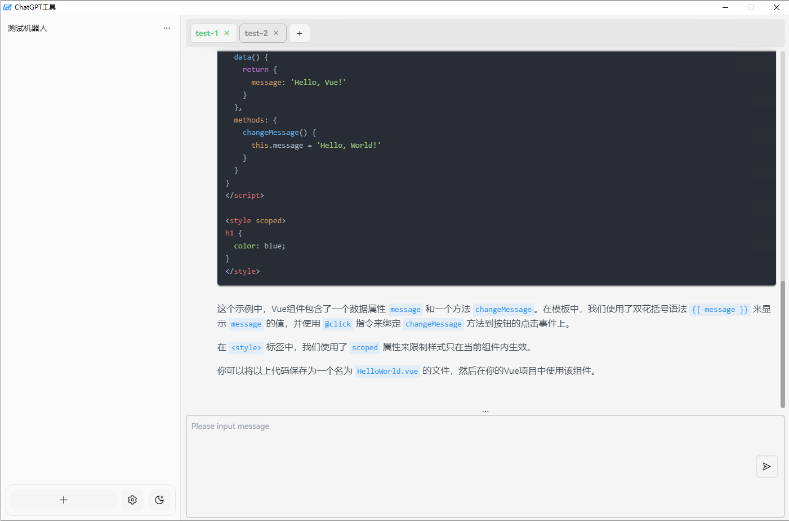
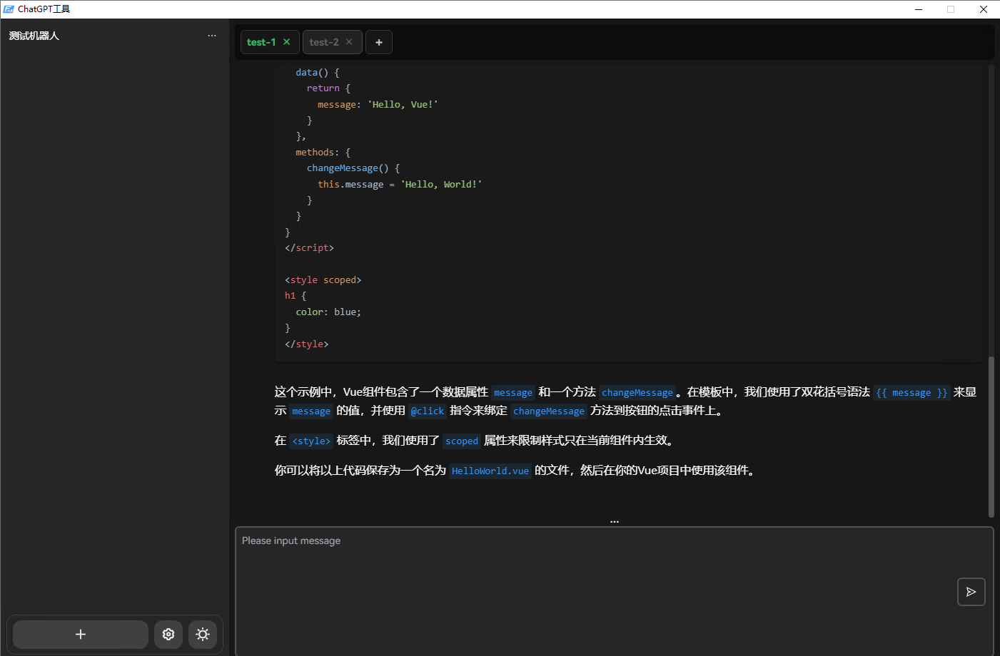

<h2 align="center">

<span>ChatGPTBox</span>
</h2>

<p align="center">
    <em>Electron跨平台ChatGPT工具箱，支持 GPT-3.5 / GPT-4 API。</em>
</p>

<p align="center">
    =7-brightgreen?logo=windows">
    =10-blue?logo=apple">
</p>

<p align="center">
    
    
</p>

## 特性

- 支持多平台，Windows、Linux、macOS
- 可单独自定义聊天配置，多聊天配置互不干扰
- 单聊天配置支持多标签页，可同时打开多个聊天窗口
- 全局快捷键支持，可自定义快捷键

## 规划

- [x] 多标签页
- [x] 快捷键设置
- [x] 深色模式切换
- [x] 多模型支持
- [ ] 移动端支持
    - [x] 移动端网页
    - [ ] Android
    - [ ] iOS
- [ ] DALL·E 图片生成
- [ ] TTS 语音合成
- [ ] Whisper 语音识别

## 教程

### 下载/打包

下载最新版本：
* [Window](http://192.168.32.60:3008/release/Chat-GPT-Client-v1.0.0-darwin-ia32-setup.exe)
* [Macos](http://192.168.32.60:3008/release/Chat-GPT-Client-1.0.0-darwin.dmg)
可下载已打包好的可执行文件，也可自行打包。

```shell
# 安装依赖
pnpm install

# 打包Web版本
pnpm run build

# 打包electron桌面版本
cd app
pnpm install 
pnpm run win
```

### 安装

#### Windows

运行安装  `exe` 文件即可。


#### macOS

直接运行 `dmg` 文件，将 `ChatGPTClient.app` 拖到 `Applications` 文件夹，
随后打开 `Finder`，右键 `ChatGPTClient.app`，选择 `打开`，即可打开应用。

### Cloudflare Workers 部署

由于中国大陆地区无法访问 `openai` 的 `api`，所以需要使用 `Cloudflare Workers` 进行中转。

1. 注册 `Cloudflare` 账号
2. 注册域名
3. 创建 `Cloudflare Workers`
4. 将域名绑定到 `Cloudflare Workers`
5. 添加以下代码到 `Cloudflare Workers`

```javascript
const TELEGRAPH_URL = 'https://api.openai.com';

addEventListener('fetch', event => {
  event.respondWith(handleRequest(event.request))
})

async function handleRequest(request) {
  const url = new URL(request.url);
  const headers_Origin = request.headers.get("Access-Control-Allow-Origin") || "*"
  url.host = TELEGRAPH_URL.replace(/^https?:\/\//, '');
  const modifiedRequest = new Request(url.toString(), {
    headers: request.headers,
    method: request.method,
    body: request.body,
    redirect: 'follow'
  });
  const response = await fetch(modifiedRequest);
  const modifiedResponse = new Response(response.body, response);
  // 添加允许跨域访问的响应头
  modifiedResponse.headers.set('Access-Control-Allow-Origin', headers_Origin);
  return modifiedResponse;
}
```

> 完成以上步骤之后，你会发现`Cloudflare Worker`的域名也被墙了，只能通过申请域名，配合自己的域名使用 Cloudflare 的 Workers 来代理 OpenAI 的 API 地址。


## 许可证

[Apache License v2.0](./LICENSE)
